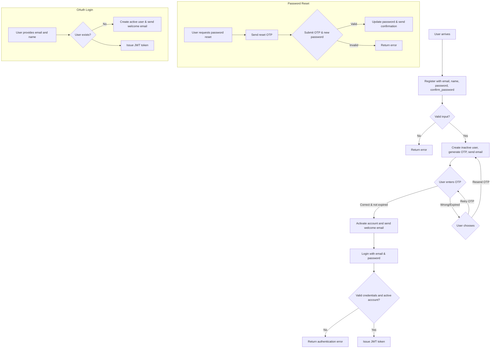

# Authentication Workflow
---

Below is the simplified flow for a user journey:



---

## Endpoints

### 1. Register User

* **Endpoint:** `POST /api/authentication/register`
* **Purpose:** Creates an inactive user and sends an OTP to their email.
* **Headers:** 
```json
x-auth-app: FRONTEND_SECRET_KEY
```
* **Request Body:**

```json
{"email": "user@example.com", "name": "User Name", "password": "pass", "confirm_password": "pass"}
```

* **Response:**

```json
{"message": "User created successfully. OTP sent to your email."}
```

### 2. Verify OTP

* **Endpoint:** `PUT /api/authentication/register`
* **Purpose:** Activates a user after OTP verification.
* **Request Body:**

```json
{"email": "user@example.com", "otp": "1234"}
```
* **Headers:** 
```json
x-auth-app: FRONTEND_SECRET_KEY
```
* **Response:**

```json
{"message": "User verified successfully"}
```

### 3. Resend OTP

* **Endpoint:** `POST /api/authentication/resendotp`
* **Purpose:** Sends a new OTP if the user is still inactive.
* **Headers:** 
```json
x-auth-app: FRONTEND_SECRET_KEY
```
* **Request Body:**

```json
{"email": "user@example.com"}
```

* **Response:**

```json
{"message": "OTP resent successfully."}
```

### 4. Login

* **Endpoint:** `POST /api/authentication/login`
* **Purpose:** Authenticates the user and returns a JWT token.

* **Headers:** 
```json
x-auth-app: FRONTEND_SECRET_KEY
```
* **Request Body:**

```json
{"email": "user@example.com", "password": "securepassword"}
```

* **Response:**

```json
{"jwt": "<token_string>"}
```

### 5. Logout

* **Endpoint:** `POST /api/authentication/logout`
* **Purpose:** Logs the user out by deleting the JWT cookie.

* **Headers:** 
```json
x-auth-app: FRONTEND_SECRET_KEY
```
* **Response:**

```json
{"message": "Logged out successfully"}
```

### 6. Password Reset Request

* **Endpoint:** `POST /api/authentication/password-reset-request`
* **Purpose:** Sends an OTP for password reset.

* **Headers:** 
```json
x-auth-app: FRONTEND_SECRET_KEY
```
* **Request Body:**

```json
{"email": "user@example.com"}
```

* **Response:**

```json
{"message": "OTP sent to your email."}
```

### 7. Password Reset

* **Endpoint:** `POST /api/authentication/password-reset`
* **Purpose:** Verifies OTP and updates the password.
* **Headers:** 
```json
x-auth-app: FRONTEND_SECRET_KEY
```
* **Request Body:**

```json
{"email": "user@example.com", "otp": "1234", "new_password": "newpass"}
```

* **Response:**

```json
{"message": "Password reset successful."}
```

### 8. User data

* **Endpoint:** `GET /api/authentication/user`
* **Purpose:** Get the data of the user
* **Headers:** 
```json
x-auth-app: (FRONTEND_SECRET_KEY)
Authorization: (jwt token)
```
* **Response:**

```json
{
  "id": 2,
  "name": "fareed",
  "email": "fareedsayed95@gmail.com",
  "is_staff": false,
  "orders": [
    {
      "id": 7,
      "order_number": "F4pw0DIi",
      "user": "fareedsayed95@gmail.com",
      "created_at": "2025-08-20T06:54:23.093086+05:30",
      "status": null,
      "address": 1,
      "orders": [
        {
          "id": 13,
          "order_no": 7,
          "product": {
            "id": 1,
            "name": "Iron",
            "max_rate": 35,
            "min_rate": 30,
            "unit": "per-kg",
            "description": "good",
            "category": 2
          },
          "quantity": "2.00"
        },
        {
          "id": 14,
          "order_no": 7,
          "product": {
            "id": 2,
            "name": "Tin",
            "max_rate": 30,
            "min_rate": 25,
            "unit": "per-kg",
            "description": "goodf tin cans",
            "category": 2
          },
          "quantity": "3.00"
        }
      ]
    }
  ],
  "addresses": [
    {
      "id": 1,
      "name": "Home",
      "phone_number": "9876543210",
      "room_number": "101",
      "street": "MG Road",
      "area": "Chembur East",
      "city": "Mumbai",
      "state": "Maharashtra",
      "country": "India",
      "pincode": 400071,
      "delivery_suggestion": "Ring the bell twice",
      "user": 2
    }
  ]
}
```

* **Endpoint:** `PATCH /api/authentication/user`
* **Purpose:** Update the name of the user
* **Headers:** 
```json
x-auth-app: (FRONTEND_SECRET_KEY)
Authorization: (jwt token)
```
* **Request Body:**

```json
{"name":"Fareed Say"}
```

* **Response:**

```json
{
  "message": "Your name is updated successfully to Fareed Say"
}
```


* **Endpoint:** `DELETE /api/authentication/user`
* **Purpose:** Update the name of the user
* **Headers:** 
```json
x-auth-app: (FRONTEND_SECRET_KEY)
Authorization: (jwt token)
```
* **Response:**

```json
{"message": "Your account has been deleted successfully"}
```

---

## Email Templates

Located in `api/authentication/templates/email/`:

* `registeration_otp.html`
* `welcome.html`
* `otp_resend.html`
* `password_reset.html`
* `password_reset_successful.html` (fix naming to match the view)


